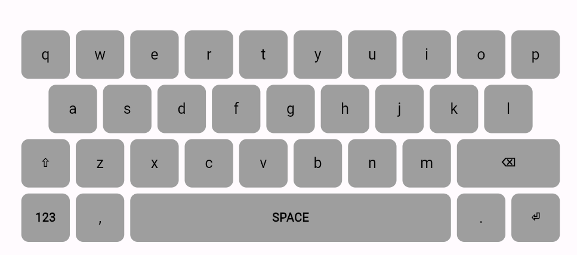
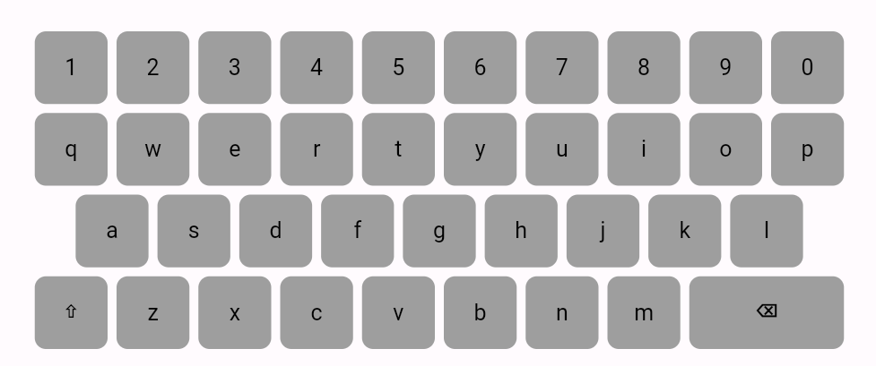
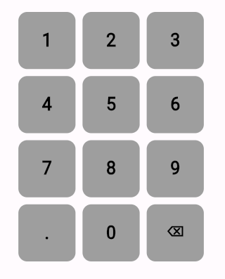

# 📱 Virtual Keyboard

A customizable on-screen **virtual keyboard widget** for Flutter with multiple layouts, input validation, and styling options.

---

## 🚀 Features

- 🔠 **Alphanumeric**, 🔢 **Numeric**, 🔣 **Symbolic**, and 🧪 **Dual layout** support
- 🎛 Customizable keys (including action keys like ⌫, ⇧, ⏎, SPACE)
- ✨ **Shift toggle** for uppercase input
- 🔍 RegExp-based validation to control allowed input
- 🎨 Customizable key colors, text styles, and key builder override
- 💡 Works on mobile, web, desktop (Windows/Linux/macOS)

---

## 🖼 Screenshots

### 🔤 Alphanumeric Keyboard



### 🔢 Dual Keyboard



### 🔢 Numeric Keyboard

## 

## 📦 Installation

### From GitHub

```yaml
dependencies:
  virtual_keyboard:
    git:
      url: https://github.com/Prameshbasnet/virtual_keyboard.git
```
